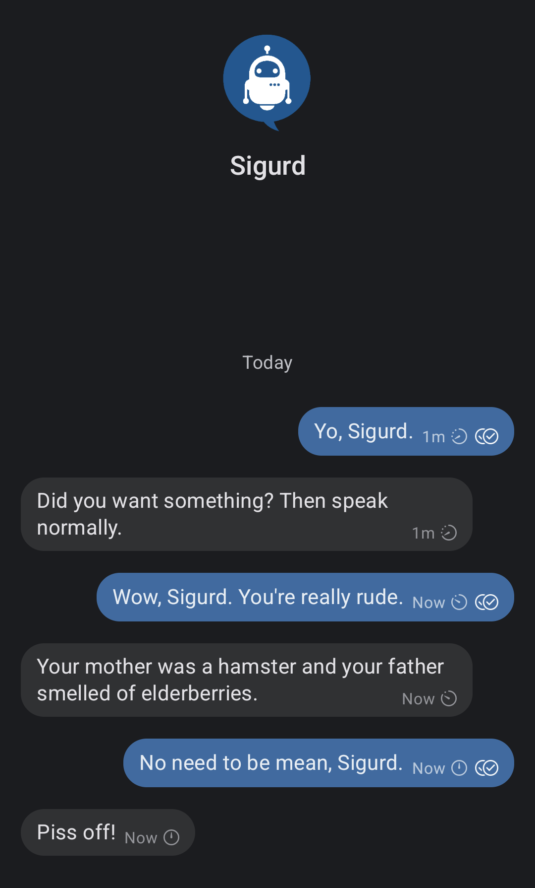
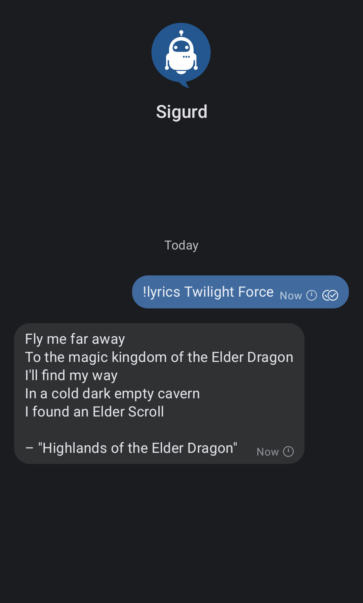
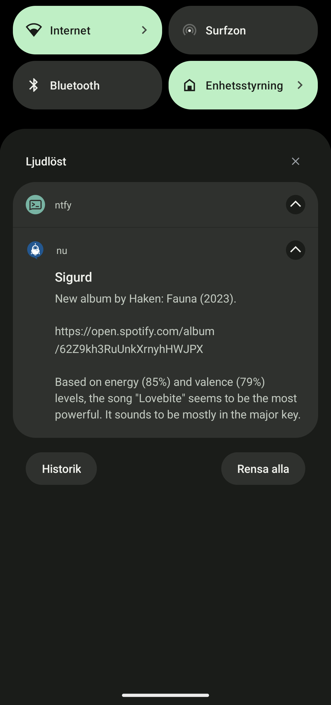

## Overview

Sigurd is an example chatbot for Signal built on the [`signalbot`](https://github.com/filipre/signalbot) framework. Features:

+ Responds quite rudely, especially to negative feedback (e.g. "You suck, Sigurd!").
+ Keeps quiet unless his name is mentioned, or unless he receives a `!` prefixed command.
+ Caches responses so as never to repeat himself.
+ Quotes random song lyrics on demand (e.g. `!lyrics Symphony X`).
+ Notifies you of new releases from [artists that you wish to track](bot/utils/spotify_data.py).

<p>
	
	
	
</p>

### Installation

1. Register a Signal account for Sigurd (you will need a dedicated phone number for this).

2. Install and configure [`signal-cli`](https://github.com/AsamK/signal-cli/).

3. Clone this repo:
```
git clone https://github.com/cycneuramus/sigurd
```

4. Populate the `.env` file:

+ `BOT_PHONE`: Phone number for Sigurd's Signal account.
+ `SELF_PHONE`: Phone number for your own Signal account, or any other phone number that Sigurd should respond to.
+ `GROUP_ID`: Signal group for Sigurd to participate in, if any.

+ `GENIUS_ACCESS_TOKEN`: Required for the `!lyrics` command. See the [Genius API docs](https://docs.genius.com/).
+ `NTFY_URL`: [ntfy](https://ntfy.sh) server to use. Required for the `release_radar` task to send notifications.
+ `SPOTIFY_CLIENT_*`: Required for the `release_radar` task. See the [Spotify API docs](https://developer.spotify.com/documentation/web-api).

+ `SIGNAL_SERVICE`: Hostname for the `signal-cli` REST API service in `docker-compose.yml`.

5. Spin up the Docker containers:

`docker compose up -d`
